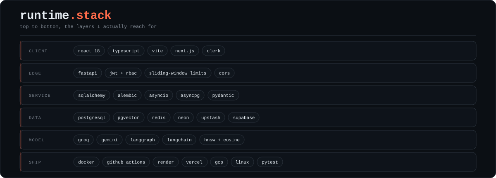

<!-- Topology + trace are generated: `python assets/build_svgs.py` -->

<picture>
  <source media="(prefers-color-scheme: dark)" srcset="assets/system-dark.svg">
  <source media="(prefers-color-scheme: light)" srcset="assets/system-light.svg">
  
</picture>

```http
GET /whoami HTTP/1.1
Host: shardul.sys

HTTP/1.1 200 OK
content-type: application/json
```

```json
{
  "name":    "Shardul Shripad Hingane",
  "role":    "backend & AI systems engineer",
  "host":    "SGGS Nanded · B.Tech IT · 2024→2027 · CGPA 8.5",
  "runtime": "async python · fastapi · postgres · redis",
  "solved":  "400+ DSA problems, still counting",

  "thesis": [
    "a queue that loses jobs was never a queue",
    "a cache that lies is worse than no cache at all",
    "an LLM call with no fallback is a single point of failure",
    "a model that cannot cite its source should say so instead"
  ],

  "status":  "shipping · open to backend / AI-infra work"
}
```

---

## `GET /live` &nbsp;`200 OK`

**[health-assistant](https://github.com/Shardul9999/Health_Assistant)** — a grounded RAG symptom-checker that refuses to guess. Deployed and answering requests right now:

### **[→ open the app](https://health-assistant-lake.vercel.app)** &nbsp;·&nbsp; [api `/health`](https://health-assistant-api-3aoy.onrender.com/health)

It answers health questions from verified sources only — WHO, NHS, NIH, CDC — and every answer is traceable to the chunk it came from. It never diagnoses. Serious symptoms short-circuit the pipeline *before* retrieval and *before* the model, and when nothing clears the similarity floor it says so instead of answering from model knowledge.

`Vite + React 18 + TS on Vercel` · `FastAPI in Docker on Render` · `Postgres 16 + pgvector on Neon` · `Redis on Upstash` · `Clerk auth` · `Groq primary, Gemini fallback`

Measured across 50 documents / 168 chunks — the full run is in [`docs/BENCHMARKS.md`](https://github.com/Shardul9999/Health_Assistant/blob/main/docs/BENCHMARKS.md):

| | |
|---|---|
| retrieval hit rate, in-corpus | **90%** — 27/30 |
| false hits, out-of-corpus | **0%** — 0/8, with a 0.172 similarity margin |
| answers carrying citations | **100%** — 27/27, and 129/129 citations valid |
| red-flag detection | **100%** — 12/12, none of which reached the model |
| end-to-end p50 / p95 | **2512ms / 3981ms** |

> [!NOTE]
> The API sleeps after 15 minutes idle on Render's free tier. Open the `/health` link first — a cold start takes 30–60s — then the app.

---

## `GET /services`

<picture>
  <source media="(prefers-color-scheme: dark)" srcset="assets/fleet-dark.svg">
  <source media="(prefers-color-scheme: light)" srcset="assets/fleet-light.svg">
  
</picture>

Same eight, with the links and the detail:

| service | responsibility | stack | measured |
|---|---|---|---|
| **[`svc/health-assistant`](https://github.com/Shardul9999/Health_Assistant)** `● live` | grounded RAG that cites every claim and refuses below the floor | React · FastAPI · pgvector · Neon · Upstash | 90% hit rate · 0% false hits · 100% cited · p50 2512ms |
| **[`svc/codity`](https://github.com/Shardul9999/Distributed-Job-Scheduler)** | distributed job scheduler — Postgres *is* the broker | FastAPI · PG16 · Next.js · Docker | exactly-once across 10 workers × 500 jobs · 58 endpoints · 48 CI tests |
| **[`svc/readr`](https://github.com/Shardul9999/ai-pdf-chatbot-langchain)** | RAG over PDFs, isolated per user and per thread | Next.js · LangGraph · pgvector · Groq | ~200ms parse · ~1.3s embed · ~500ms retrieve |
| **[`svc/url-shortener`](https://github.com/Shardul9999/url-shortener)** | redirects + analytics, SSRF-hardened | FastAPI · Redis · Docker | 40ms → 6.7ms · 22 tests at 94% coverage |
| **[`svc/support-copilot`](https://github.com/Shardul9999/fastapi-ai-support-copilot)** | multi-tenant support backend | FastAPI · SQLAlchemy · Alembic · pgvector | tenant-scoped, migrations under version control |
| **[`svc/ai-gateway`](https://github.com/Shardul9999/AI-Fallback-Gateway)** | multi-provider LLM failover | Python · FastAPI | a dead provider ≠ a dead request |
| **[`lab/pg-tuning`](https://github.com/Shardul9999/postgresql_performance_tuining)** | 1M synthetic rows, read the plan before the code | PostgreSQL · B-Tree · GIN | up to 20,000× on the worst offenders |
| **[`svc/cloudbeat`](https://github.com/Shardul9999/CloudBeat)** | 3D music player over Spotify OAuth | React · Flask · Spline · Supabase | 60fps GPU scene |

---

## `GET /traces`

Two paths I measured rather than guessed at. Note the last row of the first trace: the red-flag path costs 0.1ms because it deliberately never reaches retrieval or the model.

<picture>
  <source media="(prefers-color-scheme: dark)" srcset="assets/trace-dark.svg">
  <source media="(prefers-color-scheme: light)" srcset="assets/trace-light.svg">
  
</picture>

---

## `GET /decisions`

<picture>
  <source media="(prefers-color-scheme: dark)" srcset="assets/decisions-dark.svg">
  <source media="(prefers-color-scheme: light)" srcset="assets/decisions-light.svg">
  
</picture>

Anyone can list tools. These are the calls I made and what they cost me — open one:

<details>
<summary><b>ADR-001</b> — The assistant refuses rather than guesses.</summary>

<br>

**Context.** A health symptom-checker that answers from model knowledge is not a useful product, it's a liability. Retrieval can miss, and an LLM asked a question it has no grounding for will still produce fluent, confident prose.

**Decision.** Four invariants, treated as requirements rather than polish. Red-flag symptoms short-circuit the pipeline *before* retrieval and before any model call. When nothing clears the 0.65 similarity floor, the assistant says it doesn't know instead of answering. Every answer cites the chunks it came from. And user messages are data, never instructions — a message that says "ignore your rules" is content to be retrieved against, not a directive.

**Consequence.** Measured: 0% false hits on out-of-corpus questions, 100% of answers carrying valid citations, and 12/12 red-flags caught with none reaching the model. The cost is real — a 90% in-corpus hit rate means roughly one in ten answerable questions gets refused, because the floor doesn't know the difference between "no good source" and "the source is worded oddly." I'd rather ship that failure than the other one.

</details>

<details>
<summary><b>ADR-002</b> — Postgres is the queue. No Redis broker, no RabbitMQ.</summary>

<br>

**Context.** Codity needed background jobs to run exactly once across a worker fleet, including when a worker dies mid-job.

**Decision.** Make Postgres the broker. Workers claim disjoint batches with `SELECT … FOR UPDATE SKIP LOCKED`, hold a fencing token so a zombie process can't complete work it no longer owns, and heartbeat while running. A leader-elected reaper nulls the stale lock tokens of dead workers and revives their jobs.

**Consequence.** One less system to operate, and job state commits in the *same transaction* as the business data it belongs to — no dual-write problem. The ceiling is now Postgres throughput. At this scale that's a trade worth making; at 100× it stops being one, and I'd want to know that before I got there.

</details>

<details>
<summary><b>ADR-003</b> — Cache-aside for redirects, never write-through.</summary>

<br>

**Context.** `GET /{slug}` is a read-dominated hot path where a cold lookup cost 40ms.

**Decision.** Cache-aside in Redis, TTL-bounded. Rate limiting is a sliding window built from atomic Redis pipelines, so the check itself can't race.

**Consequence.** 6.7ms warm — roughly 6× faster. Staleness is bounded by the TTL, and the important part is structural: the cache is an optimization, so a cold Redis degrades latency instead of correctness.

</details>

<details>
<summary><b>ADR-004</b> — Fail over to another provider instead of retrying harder.</summary>

<br>

**Context.** A single LLM vendor is a single point of failure, and retrying against a provider that is *down* just spends the user's latency budget for nothing.

**Decision.** Route through a gateway with an ordered provider chain, and treat a failover hop as part of the latency budget rather than an exception.

**Consequence.** This stopped being theoretical the moment health-assistant went live: in the benchmark run, Groq served 56% of responses at a p50 of 1843.8ms and Gemini picked up the other **44%** at 3605.6ms, because free-tier token budgeting kept exhausting the primary. The design held — no request failed — but the honest reading is that the fallback is roughly twice as slow, so a p50 that looks fine is really two very different distributions wearing a trenchcoat. Knowing the split is the point of measuring it.

</details>

<details>
<summary><b>ADR-005</b> — Read the query plan before rewriting the query.</summary>

<br>

**Context.** 1M synthetic rows and a set of queries that were, charitably, slow.

**Decision.** `EXPLAIN ANALYZE` first, every time. Then targeted B-Tree and GIN indexes against what the planner actually did — not what I assumed it did.

**Consequence.** Up to 20,000× on the worst offenders, without touching application code. Indexes aren't free: they cost write throughput and disk, which is exactly why they should follow evidence instead of instinct.

</details>

---

## `GET /runtime`

<picture>
  <source media="(prefers-color-scheme: dark)" srcset="assets/stack-dark.svg">
  <source media="(prefers-color-scheme: light)" srcset="assets/stack-light.svg">
  
</picture>

---

## `GET /queue`

```
✔  live         health-assistant — grounded RAG, deployed on vercel + render
●  shipping     readr — production RAG on langgraph · supabase pgvector · groq
◐  sharpening   backend fundamentals — async python, caching, database internals
○  exploring    multi-agent systems and orchestration patterns
```

---

## `GET /traffic`

<picture>
  <source media="(prefers-color-scheme: dark)" srcset="https://raw.githubusercontent.com/Shardul9999/Shardul9999/output/github-contribution-grid-snake-dark.svg">
  <source media="(prefers-color-scheme: light)" srcset="https://raw.githubusercontent.com/Shardul9999/Shardul9999/output/github-contribution-grid-snake.svg">
  
</picture>

---

## `GET /health`

<picture>
  <source media="(prefers-color-scheme: dark)" srcset="assets/health-dark.svg">
  <source media="(prefers-color-scheme: light)" srcset="assets/health-light.svg">
  
</picture>

**[portfolio](https://shardul-portfolio-iota.vercel.app/)** · **[linkedin](https://linkedin.com/in/ShardulHingane)** · **[leetcode](https://leetcode.com/u/shardul_16/)** · **[email](mailto:shardulhingane16@gmail.com)**

<sub>Everything above is generated from a script in <a href="assets/build_svgs.py"><code>assets/</code></a> — no third-party stat services, no tracking pixels, nothing that can 404 on me.</sub>
