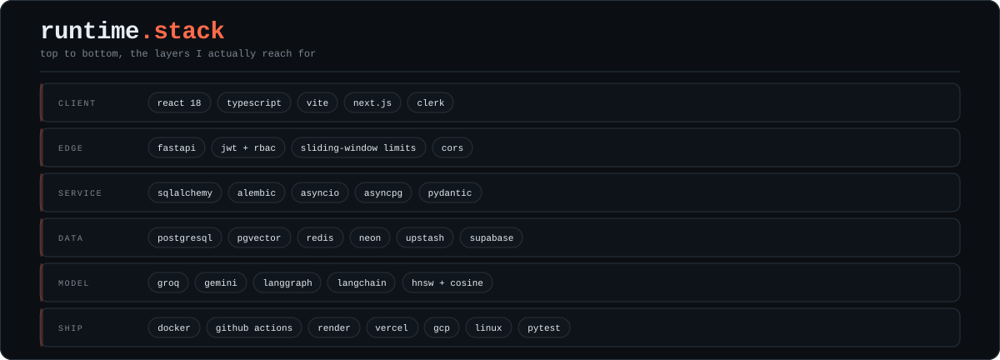

<!-- Topology + trace are generated: `python assets/build_svgs.py` -->

<picture>
  <source media="(prefers-color-scheme: dark)" srcset="assets/system-dark.svg">
  <source media="(prefers-color-scheme: light)" srcset="assets/system-light.svg">
  
</picture>

```text
GET /whoami → 200 OK
Shardul Shripad Hingane · Backend & AI systems engineer
Building reliable APIs and grounded AI. Open to backend / AI-infra work.
```

---

## `GET /live` &nbsp;`200 OK`

### health-assistant · `live`

Grounded health Q&A with source citations, red-flag checks, and refusal when sources fall short.

**90% retrieval hit rate** in a 30-question in-corpus benchmark.<br>
[Demo](https://health-assistant-lake.vercel.app) · [Code](https://github.com/Shardul9999/Health_Assistant) · [API health](https://health-assistant-api-3aoy.onrender.com/health)

<details>
<summary>Benchmarks & deployment</summary>

React · FastAPI · Postgres + pgvector · Redis · Groq / Gemini fallback.

Measured across 50 documents / 168 chunks. [Full benchmark report](https://github.com/Shardul9999/Health_Assistant/blob/main/docs/BENCHMARKS.md).

| Metric | Result |
|---|---|
| Retrieval hit rate, in-corpus | 90% — 27/30 |
| False hits, out-of-corpus | 0/8 — similarity margin 0.172 |
| Answers carrying citations | 27/27 — all 129 citations valid |
| Red-flag detection | 12/12 — none reached the model |
| End-to-end p50 / p95 | 2512ms / 3981ms |

</details>

<sub>Health-assistant may take 30–60s to wake up. Open API health first if the demo is waiting.</sub>

### url-shortener · `live`

SSRF-hardened redirects with Redis caching, rate limits, and click analytics.

**~6× faster cached lookups** — 39.96ms → 6.68ms in the benchmark.<br>
[Demo](https://url-shortener-eight-murex.vercel.app/) · [Code](https://github.com/Shardul9999/url-shortener) · [API docs](https://url-shortener-672q.onrender.com/docs) · [API health](https://url-shortener-672q.onrender.com/health)

<details>
<summary>Benchmarks & deployment</summary>

React · FastAPI · Postgres · Redis. Frontend on Vercel, API on Render.

| Metric | Result |
|---|---|
| Cache miss — Postgres round-trip | ~39.96ms |
| Cache hit — Redis | ~6.68ms |
| Test suite & coverage | 22 tests — 94% coverage |
| Sliding-window limits | 100 req/min shorten · 1,000 req/min redirect |

</details>

---

## `GET /services`

<picture>
  <source media="(prefers-color-scheme: dark)" srcset="assets/fleet-dark.svg">
  <source media="(prefers-color-scheme: light)" srcset="assets/fleet-light.svg">
  
</picture>

[Health Assistant](https://github.com/Shardul9999/Health_Assistant) · [Codity](https://github.com/Shardul9999/Distributed-Job-Scheduler) · [Readr](https://github.com/Shardul9999/ai-pdf-chatbot-langchain) · [URL Shortener](https://github.com/Shardul9999/url-shortener)<br>
[Support Copilot](https://github.com/Shardul9999/fastapi-ai-support-copilot) · [AI Gateway](https://github.com/Shardul9999/AI-Fallback-Gateway) · [PG Tuning](https://github.com/Shardul9999/postgresql_performance_tuining) · [CloudBeat](https://github.com/Shardul9999/CloudBeat)

---

## `GET /traces`

<picture>
  <source media="(prefers-color-scheme: dark)" srcset="assets/trace-dark.svg">
  <source media="(prefers-color-scheme: light)" srcset="assets/trace-light.svg">
  
</picture>

---

## `GET /decisions`

<picture>
  <source media="(prefers-color-scheme: dark)" srcset="assets/decisions-dark.svg">
  <source media="(prefers-color-scheme: light)" srcset="assets/decisions-light.svg">
  
</picture>

<details>
<summary><b>ADR-001</b> — The assistant refuses rather than guesses.</summary>

<br>

**Context.** A health symptom-checker that answers from model knowledge is not a useful product, it's a liability. Retrieval can miss, and an LLM asked a question it has no grounding for will still produce fluent, confident prose.

**Decision.** Four invariants, treated as requirements rather than polish. Red-flag symptoms short-circuit the pipeline *before* retrieval and before any model call. When nothing clears the 0.65 similarity floor, the assistant says it doesn't know instead of answering. Every answer cites the chunks it came from. And user messages are data, never instructions — a message that says "ignore your rules" is content to be retrieved against, not a directive.

**Consequence.** Measured: 0% false hits on out-of-corpus questions, 100% of answers carrying valid citations, and 12/12 red-flags caught with none reaching the model. The cost is real — a 90% in-corpus hit rate means roughly one in ten answerable questions gets refused, because the floor doesn't know the difference between "no good source" and "the source is worded oddly." I'd rather ship that failure than the other one.

</details>

<details>
<summary><b>ADR-002</b> — Postgres is the queue. No Redis broker, no RabbitMQ.</summary>

<br>

**Context.** Codity needed background jobs to run exactly once across a worker fleet, including when a worker dies mid-job.

**Decision.** Make Postgres the broker. Workers claim disjoint batches with `SELECT … FOR UPDATE SKIP LOCKED`, hold a fencing token so a zombie process can't complete work it no longer owns, and heartbeat while running. A leader-elected reaper nulls the stale lock tokens of dead workers and revives their jobs.

**Consequence.** One less system to operate, and job state commits in the *same transaction* as the business data it belongs to — no dual-write problem. The ceiling is now Postgres throughput. At this scale that's a trade worth making; at 100× it stops being one, and I'd want to know that before I got there.

</details>

<details>
<summary><b>ADR-003</b> — Cache-aside for redirects, never write-through.</summary>

<br>

**Context.** `GET /{slug}` is a read-dominated hot path where a cold lookup cost 40ms.

**Decision.** Cache-aside in Redis, TTL-bounded. Rate limiting is a sliding window built from atomic Redis pipelines, so the check itself can't race.

**Consequence.** 6.7ms warm — roughly 6× faster. Staleness is bounded by the TTL, and the important part is structural: the cache is an optimization, so a cold Redis degrades latency instead of correctness.

</details>

<details>
<summary><b>ADR-004</b> — Fail over to another provider instead of retrying harder.</summary>

<br>

**Context.** A single LLM vendor is a single point of failure, and retrying against a provider that is *down* just spends the user's latency budget for nothing.

**Decision.** Route through a gateway with an ordered provider chain, and treat a failover hop as part of the latency budget rather than an exception.

**Consequence.** This stopped being theoretical the moment health-assistant went live: in the benchmark run, Groq served 56% of responses at a p50 of 1843.8ms and Gemini picked up the other **44%** at 3605.6ms, because free-tier token budgeting kept exhausting the primary. The design held — no request failed — but the honest reading is that the fallback is roughly twice as slow, so a p50 that looks fine is really two very different distributions wearing a trenchcoat. Knowing the split is the point of measuring it.

</details>

<details>
<summary><b>ADR-005</b> — Read the query plan before rewriting the query.</summary>

<br>

**Context.** 1M synthetic rows and a set of queries that were, charitably, slow.

**Decision.** `EXPLAIN ANALYZE` first, every time. Then targeted B-Tree and GIN indexes against what the planner actually did — not what I assumed it did.

**Consequence.** Up to 20,000× on the worst offenders, without touching application code. Indexes aren't free: they cost write throughput and disk, which is exactly why they should follow evidence instead of instinct.

</details>

---

## `GET /runtime`

<picture>
  <source media="(prefers-color-scheme: dark)" srcset="assets/stack-dark.svg">
  <source media="(prefers-color-scheme: light)" srcset="assets/stack-light.svg">
  
</picture>

---

## `GET /queue`

```
●  shipping     readr — RAG over PDFs
◐  sharpening   async Python · caching · database internals
○  exploring    multi-agent orchestration
```

---

## `GET /traffic`

<picture>
  <source media="(prefers-color-scheme: dark)" srcset="https://raw.githubusercontent.com/Shardul9999/Shardul9999/output/github-contribution-grid-snake-dark.svg">
  <source media="(prefers-color-scheme: light)" srcset="https://raw.githubusercontent.com/Shardul9999/Shardul9999/output/github-contribution-grid-snake.svg">
  
</picture>

---

## `GET /health`

<picture>
  <source media="(prefers-color-scheme: dark)" srcset="assets/health-dark.svg">
  <source media="(prefers-color-scheme: light)" srcset="assets/health-light.svg">
  
</picture>

**[portfolio](https://shardulportfolio-rose.vercel.app/)** · **[linkedin](https://linkedin.com/in/ShardulHingane)** · **[leetcode](https://leetcode.com/u/shardul_16/)** · **[email](mailto:shardulhingane16@gmail.com)**
